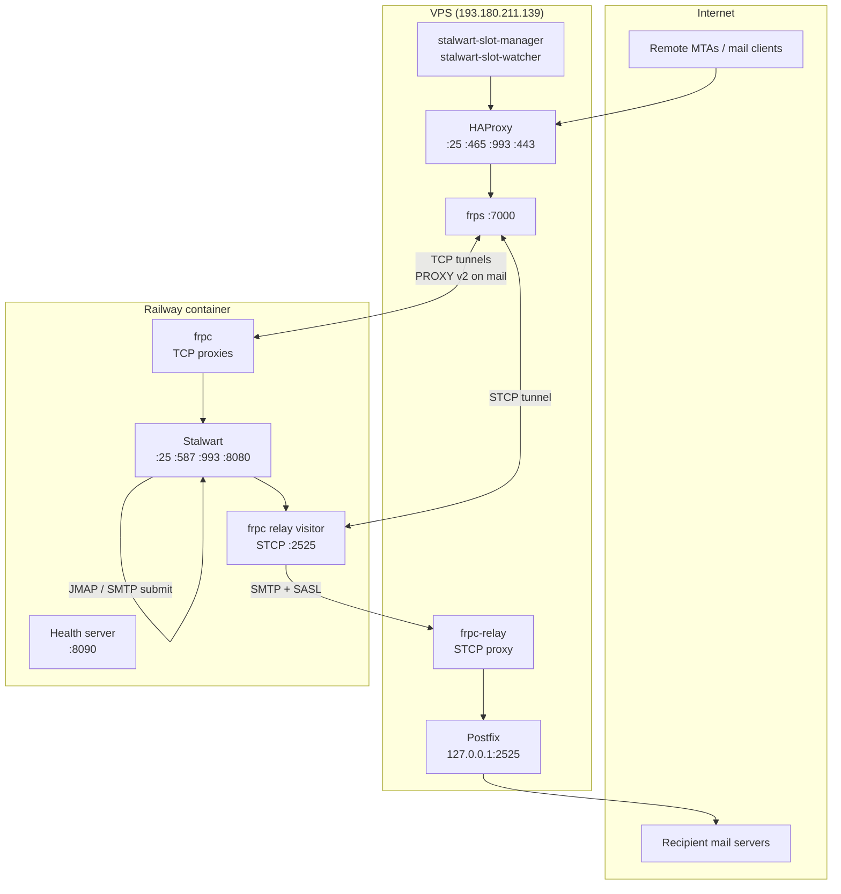
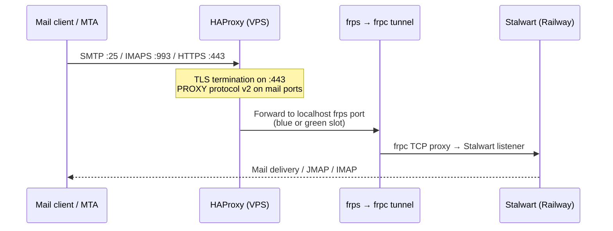
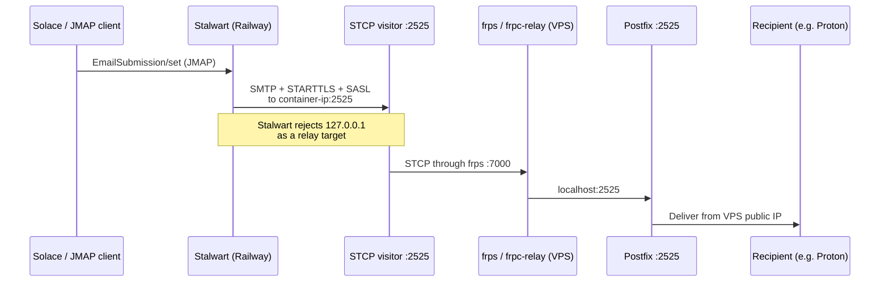
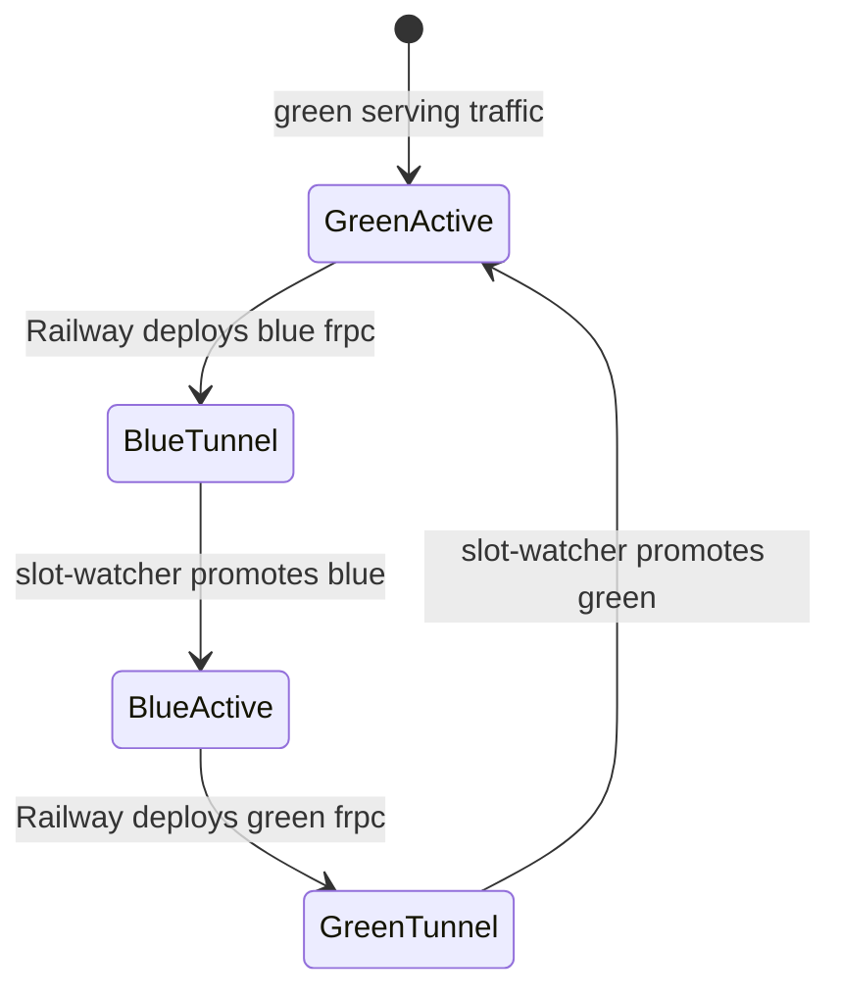

# Stalwart on Railway (Solace mail)

Stalwart mail server runs on [Railway](https://railway.app). A public VPS
(`mail.solace.onl` / `193.180.211.139`) owns the MX, TLS certificates, and
inbound ports. Railway containers connect **outbound** to the VPS over frp — no
inbound connections to Railway are required.

## System overview

## Inbound mail (Internet → Stalwart)

HAProxy routes to **blue** or **green** frps ports based on
`/etc/haproxy/stalwart-active-slot`. Only one slot receives traffic at a time.
The VPS slot watcher promotes a slot when its frp tunnel is healthy.

| Slot  | SMTP frps port | HTTPS frps port |
|-------|----------------|-----------------|
| blue  | 10025          | 10443           |
| green | 11025          | 11443           |

Railway's `FRPC_SLOT=auto` picks the **inactive** side so a new deploy tunnels
up before the VPS switches traffic.

## Outbound mail (Solace / JMAP → Internet)

Railway **blocks outbound SMTP ports** (25, 587, 465). Outbound mail uses an
frp **STCP** tunnel instead of connecting to the VPS public IP.

At container startup, `railway-entrypoint.sh`:

1. Starts the STCP visitor on `0.0.0.0:2525`
2. Detects the container private IP
3. Updates the Stalwart `relay-vps` MtaRoute via `stalwart-cli`
4. Reloads Stalwart settings

See [vps/OUTBOUND_RELAY.md](vps/OUTBOUND_RELAY.md) for credentials and
troubleshooting.

## Blue/green deploys

The Railway container does **not** call the VPS to switch slots. The VPS
`stalwart-slot-watcher` polls frp port health and runs `stalwart-switch-slot.sh`.

## Repository layout

| Path | Purpose |
|------|---------|
| `railway-entrypoint.sh` | Stalwart + health server + frpc + relay setup |
| `railway.toml` | Railway healthcheck config |
| `Dockerfile` | Stalwart image + frpc + stalwart-cli |
| `vps/haproxy.cfg` | Public edge proxy (install on VPS) |
| `vps/frps.toml` | frp server for inbound tunnels |
| `vps/frpc-relay.toml` | STCP proxy for outbound Postfix |
| `vps/postfix-*.cf` | Outbound relay Postfix config |
| `vps/stalwart-slot-*.py` | Slot manager API and auto-promotion |
| `VPS_SERVICES.md` | VPS service reference and ops commands |

## Railway environment variables

| Variable | Required | Purpose |
|----------|----------|---------|
| `FRPS_ADDR` | yes | VPS IP or hostname |
| `FRPC_TOKEN` | yes | frp auth token (must match `vps/frps.toml`) |
| `STALWART_ADMIN_TOKEN` | yes | Updates relay route at startup |
| `PORT` | yes | Set to `8090` — Railway healthcheck port |
| `PGHOST`, `PGPASSWORD`, etc. | yes | PostgreSQL (Railway plugin) |
| `FRPC_SLOT` | no | `blue`, `green`, or `auto` (default) |
| `STALWART_HTTP_PORT` | no | Stalwart HTTP/JMAP port (default `8080`) |
| `RELAY_ROUTE_ID` | no | Stalwart MtaRoute id (default `ivnbzc1aaba9`) |
| `RELAY_BIND_ADDR` | no | Override container IP for relay route |

## Healthchecks

Railway probes `GET /healthz/ready` on `PORT` (8090). A small Python HTTP
server in the entrypoint answers this directly.

Stalwart's real HTTP listener on `:8080` only works through HAProxy with PROXY
protocol, so it cannot be used as the Railway healthcheck target.

## VPS quick start

Copy configs from `vps/` to the VPS, enable services, and open firewall ports
22, 25, 465, 587, 993, 443, 7000. Full service reference:
[VPS_SERVICES.md](VPS_SERVICES.md).
