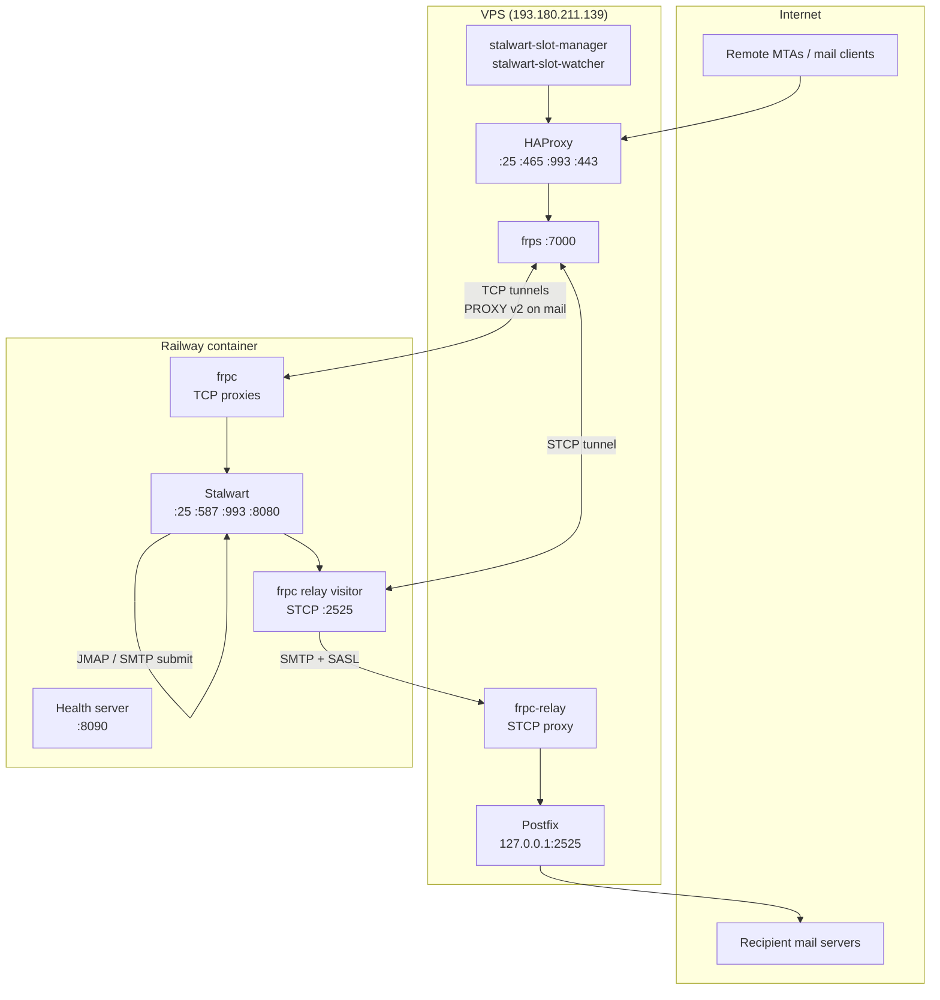
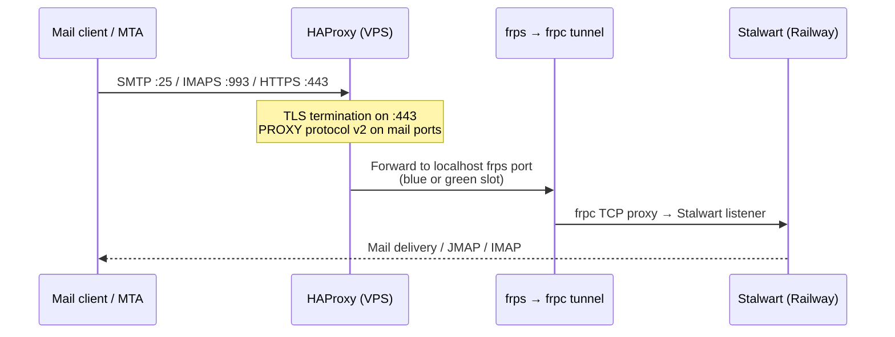
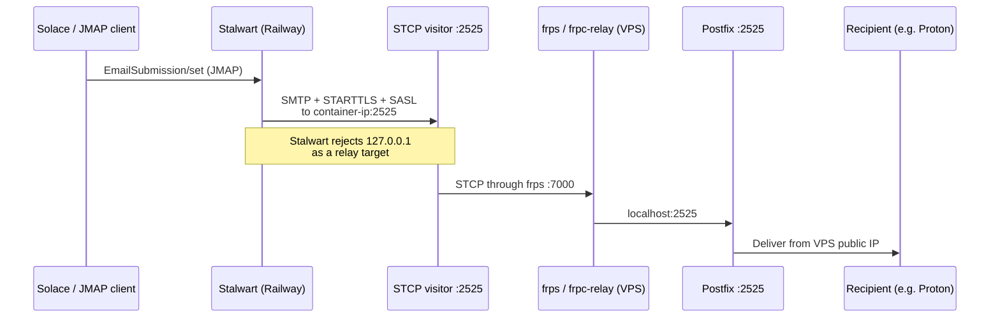
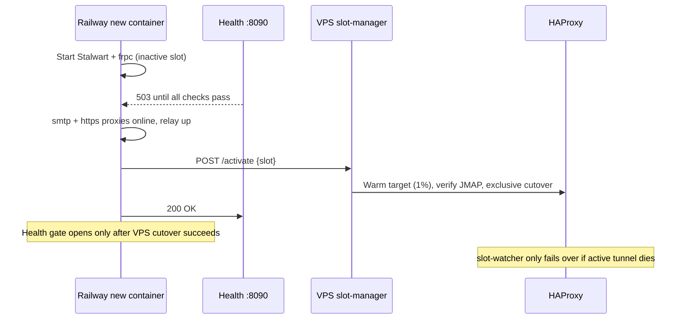

# Stalwart on Railway (Solace mail)

Stalwart mail server runs on [Railway](https://railway.app). A public VPS
(`mail.solace.onl` / `193.180.211.139`) owns the MX, TLS certificates, and
inbound ports. Railway containers connect **outbound** to the VPS over frp — no
inbound connections to Railway are required.

## System overview

## Inbound mail (Internet → Stalwart)

HAProxy routes to **blue** or **green** frps ports based on
`/etc/haproxy/stalwart-active-slot`. Only one slot receives traffic at a time.
The VPS slot watcher promotes a slot when its frp tunnel is healthy.

| Slot  | SMTP frps port | HTTPS frps port |
|-------|----------------|-----------------|
| blue  | 10025          | 18080           |
| green | 11025          | 19080           |

Railway's `FRPC_SLOT=auto` picks the **inactive** side so a new deploy tunnels
up before the VPS switches traffic.

## Outbound mail (Solace / JMAP → Internet)

Railway **blocks outbound SMTP ports** (25, 587, 465). Outbound mail uses an
frp **STCP** tunnel instead of connecting to the VPS public IP.

At container startup, `railway-entrypoint.sh`:

1. Starts the STCP visitor on `0.0.0.0:2525`
2. Detects the container private IP
3. Updates the Stalwart `relay-vps` MtaRoute via `stalwart-cli`
4. Reloads Stalwart settings

See [vps/OUTBOUND_RELAY.md](vps/OUTBOUND_RELAY.md) for credentials and
troubleshooting.

## Blue/green deploys

Railway returns **503** on `/healthz/ready` until Stalwart, frpc mail proxies,
and the outbound relay are all running. The container then requests VPS promotion
via `POST /slot-manager/activate` and only opens the Railway health gate after
the VPS has cut traffic over to this slot.

The VPS `stalwart-slot-watcher` is **failover-only** — it promotes the other
slot when the active tunnel goes down, not when both slots are up during overlap.

## Repository layout

| Path | Purpose |
|------|---------|
| `railway-entrypoint.sh` | Stalwart + health server + frpc + relay setup |
| `railway.toml` | Railway healthcheck + overlap/drain (zero-downtime once volume is detached) |
| `Dockerfile` | Stalwart image + frpc + stalwart-cli |
| `gatus/` | Gatus status page for Railway (`status.solace.onl`) |
| `vps/haproxy.cfg` | Public edge proxy (install on VPS) |
| `vps/frps.toml` | frp server for inbound tunnels |
| `vps/frpc-relay.toml` | STCP proxy for outbound Postfix |
| `vps/postfix-*.cf` | Outbound relay Postfix config |
| `vps/stalwart-slot-*.py` | Slot manager API and failover watcher |
| `vps/stalwart-switch-slot.sh` | HAProxy blue/green cutover (warm weights → edge check → exclusive) |
| `vps/haproxy-sync-active-slot.sh` | Reconcile HAProxy weights after reload |
| `vps/gatus-monitor.sh` | VPS health JSON for Gatus SSH probes |
| `vps/install-haproxy-cert.sh` | Install HAProxy `:443` PEM on the VPS |
| `scripts/sync-haproxy-cert.py` | Export Stalwart ACME cert → deploy to HAProxy |
| `.github/workflows/sync-haproxy-cert.yml` | Weekly / on-demand HAProxy cert sync |
| `VPS_SERVICES.md` | VPS service reference and ops commands |

## Status page (Gatus)

Uptime monitoring for Solace and mail lives in [`gatus/`](gatus/). Deploy it as a **second
Railway service** (root directory `gatus`, volume at `/data`, domain `status.solace.onl`).
See [gatus/README.md](gatus/README.md).

**Alert split:** Gatus Discord alerts cover endpoint/scrape failures. Stalwart Enterprise
metric Alerts (email + webhook) cover live counters such as S3/store errors and SMTP
concurrency — apply with `scripts/apply-stalwart-alerts.py` and set matching
`STALWART_WEBHOOK_BEARER` + `DISCORD_WEBHOOK_URL` on the Monitoring service so
`telemetry.alert` events reach Discord via `POST /hooks/stalwart`.

## Railway environment variables

| Variable | Required | Purpose |
|----------|----------|---------|
| `FRPS_ADDR` | yes | VPS IP or hostname |
| `FRPC_TOKEN` | yes | frp auth token (must match `vps/frps.toml`) |
| `STALWART_ADMIN_TOKEN` | yes | Updates relay route at startup |
| `SLOT_MANAGER_TOKEN` | yes | Promotes this container's slot before the Railway health gate opens |
| `PORT` | yes | Set to `8090` — Railway healthcheck port |
| `PGHOST`, `PGPASSWORD`, etc. | yes | PostgreSQL (Railway plugin) |
| `FRPC_SLOT` | no | `blue`, `green`, or `auto` (default) |
| `STALWART_HTTP_PORT` | no | Stalwart HTTP/JMAP port (default `8080`) |
| `RELAY_ROUTE_ID` | no | Stalwart MtaRoute id (default `ivnbzc1aaba9`) |
| `RELAY_BIND_ADDR` | no | Override container private IP for relay route |
| `PG_POOL_MAX_CONNECTIONS` | no | Stalwart → Postgres pool size (default `6`) |
| `BUCKET` / `BUCKET_*` | yes (for S3) | Railway bucket refs (`stalwart-blobs.*`) for BlobStore |
| `BLOB_MIGRATE_TO_S3` | no | One-shot: export volume blobs → Railway bucket |

### Blob storage (Railway bucket)

Message bodies live in the **Railway bucket** `stalwart-blobs` (Amsterdam), via
Stalwart `BlobStore` type `S3` with a custom endpoint. Postgres holds metadata
only. Access keys are read from env (`BUCKET_ACCESS_KEY_ID` /
`BUCKET_SECRET_ACCESS_KEY`), not stored in the DB.

This removes the `/var/stalwart/blobs` volume so Railway can overlap old and new
containers (zero-downtime deploys).

| Script | Purpose |
|--------|---------|
| `scripts/stalwart-blobstore-default.sh` | Emergency rollback of BlobStore to Postgres |
| `scripts/stalwart-migrate-blobs-to-fs.sh` | Legacy Postgres → volume migration |
| `scripts/stalwart-migrate-blobs-to-s3.sh` | Manual volume → bucket migration |

### Migrating volume blobs to the Railway bucket (one-time)

Bucket + credential variable references are already provisioned on
`stalwart-mail`. To migrate:

1. Keep the `/var/stalwart/blobs` volume attached for this deploy.
2. Deploy code that includes `scripts/sync-fs-blobs-to-s3.py`.
3. Set `BLOB_MIGRATE_TO_S3=true` on **stalwart-mail** and redeploy (brief outage).
4. Watch logs for `Copying N FileSystem blobs` then `Blob migration to S3 finished`.
   This **copies files from the volume into the bucket**, then flips `BlobStore` to
   S3. It does **not** use `stalwart --import` (that fails on a live database).
5. Unset `BLOB_MIGRATE_TO_S3`.
6. Detach (then delete) volume `stalwart-mail-volume-21uH`.
7. Redeploy — Railway overlap + your blue/green slot cutover can run without the volume gap.

Emergency rollback: `scripts/stalwart-blobstore-default.sh` (Postgres) or
re-attach the volume and point BlobStore back at FileSystem.

### Legacy: Migrating Postgres blobs to the volume (one-time)

Set `BLOB_MIGRATE_TO_FS=true` on **stalwart-mail** — `railway-entrypoint.sh`
runs export from Postgres (BlobStore → Default), import to the volume (BlobStore
→ FileSystem), then keeps the migrate health listener up until you redeploy
without the flag.

1. Attach a volume at `/var/stalwart/blobs` on the stalwart-mail service.
2. Set `BLOB_MIGRATE_TO_FS=true` and redeploy (brief outage).
3. Watch logs for `Blob migration finished` and export size ≈ Postgres blob data.
4. Remove `BLOB_MIGRATE_TO_FS` and redeploy to resume normal service.

Memory tuning for Railway is in `scripts/stalwart-memory-tune.sh` (`apply` runs
`scripts/apply-stalwart-tune.py` — 50 MB message cache, trimmed auxiliary
caches, disabled Postgres telemetry history). Settings persist in Postgres;
re-run after a fresh install with `STALWART_ADMIN_TOKEN` set.

Diagnostic scripts: `jmap-mailbox-profile.py`, `trace-webui-mailbox-load.py`,
`stalwart-jmap-tracer.py`, `fix-webui-jmap-queue.py`.

## PostgreSQL on Railway

Stalwart should use the **private** Postgres hostname (`*.railway.internal`) via
`PGHOST` / `DATABASE_URL`, not the public proxy URL. The entrypoint disables TLS
for `*.railway.internal` and enables it for `*.rlwy.net` proxies.

To keep total project RAM down:

1. Use the **smallest Postgres plan** that remains stable for your mail volume.
2. Keep Stalwart's pool at **6** connections (`PG_POOL_MAX_CONNECTIONS` / DataStore
   singleton — applied by `scripts/apply-stalwart-tune.py`).
3. Disable Postgres-backed **metrics history** (`MetricsStore` → Disabled) and
   **delivery tracing** (`TracingStore` → Disabled). Gatus still scrapes live
   Prometheus metrics.

Railway Postgres RAM is billed separately from the Stalwart container; lowering
Stalwart caches does not shrink the database process itself.

Relay route targets and Stalwart management API calls both use the container's
**private IP** on ports 2525 / 8080. Loopback (`127.0.0.1`) is not reachable
for HTTP inside the Railway container. The service has no public URL;
`mail.solace.onl` is the VPS edge only.

## Healthchecks

Railway probes `GET /healthz/ready` on `PORT` (8090) **before** marking a deploy
healthy. The endpoint returns **503** until all of the following are true:

- Stalwart process alive and listening on `:25` and `:8080`
- frpc process alive with `smtp-{slot}` and `https-{slot}` proxies online
- Outbound relay STCP visitor listening on `:2525`
- VPS slot promotion succeeded (`POST /slot-manager/activate`) when `SLOT_MANAGER_TOKEN` is set

With the blobs volume detached, Railway can run old and new containers at once.
Keep `railway.toml` `healthcheckPath` + `overlapSeconds` + `drainingSeconds` —
that **is** Railway’s zero-downtime deploy. Removing them falls back to an
abrupt teardown (defaults are `0`). Your blue/green slot activate still runs
before the health gate opens; overlap/drain give the old frpc tunnel time to
exit cleanly after cutover.

Stalwart's real HTTP listener on `:8080` only works through HAProxy with PROXY
protocol, so it cannot be used as the Railway healthcheck target directly.

## VPS quick start

Copy configs from `vps/` to the VPS, enable services, and open firewall ports
22, 25, 465, 587, 993, 443, 7000. Full service reference:
[VPS_SERVICES.md](VPS_SERVICES.md).
