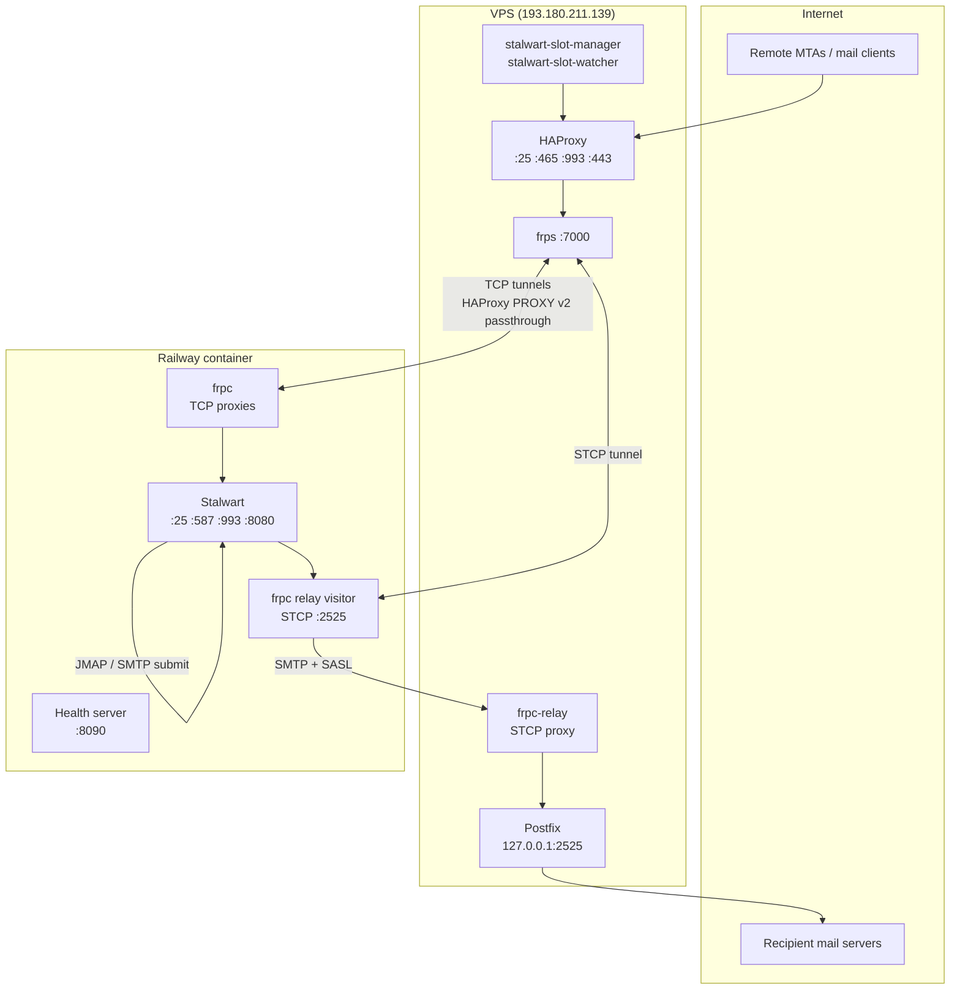
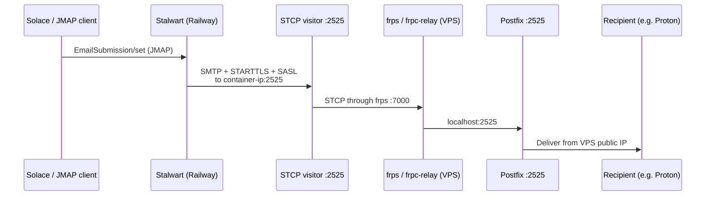
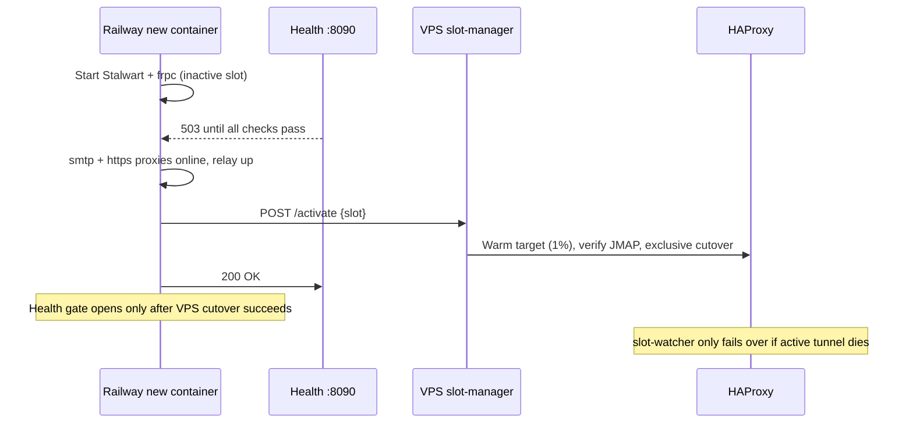

# Stalwart on Railway (Solace mail)

Stalwart mail server runs on [Railway](https://railway.app). A public VPS
(`mail.solace.onl` / `193.180.211.139`) owns the MX, TLS certificates, and
inbound ports. Railway containers connect **outbound** to the VPS over frp — no
inbound connections to Railway are required.

Desired state for Stalwart objects lives in [`stalwart/plan/`](stalwart/plan/).
WebUI edits are overwritten on the next Railway boot.

## System overview



## Config as code

[`config.json`](railway-entrypoint.sh) only names the **DataStore** (templated from Railway `PG*` env).
Everything else is JMAP objects, applied from NDJSON on every boot:

```sh
scripts/stalwart-plan.sh dry-run
scripts/stalwart-plan.sh apply
scripts/stalwart-plan.sh snapshot
scripts/stalwart-plan.sh drift
scripts/stalwart-plan.sh dns-publish
```

`railway-entrypoint.sh` runs `stalwart-cli apply` after JMAP is up and **before** the relay IP patch.
Failing apply fails the boot.

**In git:** Domain `solace.onl`, DNS/ACME/DKIM *policy*, NetworkListeners, HTTP security, Cache/JMAP/SystemSettings, MTA-STS, SenderAuth, ReportSettings, BlobStore (S3 via `EnvironmentVariable`), MetricsStore/TracingStore, Alerts, WebHooks.

**Not in git:** user accounts, mailbox data, Certificates, DkimSignature private keys, `MtaRoute.address` (container IP), Tasks/queues/logs.

**Secrets** stay in Railway variables. Plan objects use `{"@type":"EnvironmentVariable","variableName":"..."}`. Snapshot strips secrets; omit a secret field on apply so live credentials are not wiped.

DKIM keys rotate automatically (`dkimManagement: Automatic`). Stalwart does **not** continuously reconcile Cloudflare; after a new selector, run `scripts/stalwart-plan.sh dns-publish`. Do not flip MTA-STS to `enforce` until TLS-RPT reports arrive.

Admin UI is allowlisted on public HTTPS (`77.163.32.74` in `vps/haproxy.cfg` + Stalwart `allowedEndpoints`). Tunnel fallback: `ssh -N -L 8080:127.0.0.1:8080 USER@mail.solace.onl` then `http://127.0.0.1:8080/admin/`.

## Inbound mail (Internet → Stalwart)

```mermaid
sequenceDiagram
    participant C as Mail client / MTA
    participant H as HAProxy (VPS)
    participant F as frps → frpc tunnel
    participant S as Stalwart (Railway)

    C->>H: SMTP :25 / IMAPS :993 / HTTPS :443
    Note over H: TLS termination on :443<br/>one PROXY v2 header from HAProxy; frpc must not add another
    H->>F: Forward to localhost frps port<br/>(blue or green slot)
    F->>S: frpc TCP proxy → Stalwart listener
    S-->>C: Mail delivery / JMAP / IMAP
```

HAProxy routes to **blue** or **green** frps ports based on
`/etc/haproxy/stalwart-active-slot`. Railway's `FRPC_SLOT=auto` picks the **inactive** side so a new deploy tunnels up before the VPS switches traffic.

| Slot  | SMTP frps port | HTTPS frps port |
|-------|----------------|-----------------|
| blue  | 10025          | 18080           |
| green | 11025          | 19080           |

## Outbound mail (Solace / JMAP → Internet)

Railway **blocks outbound SMTP ports** (25, 587, 465). Outbound mail uses an
frp **STCP** tunnel. At boot the entrypoint starts the visitor on `:2525`, patches `MtaRoute.address` to the container private IP, then reloads settings.

See [vps/OUTBOUND_RELAY.md](vps/OUTBOUND_RELAY.md).



## Blue/green deploys



Railway probes `GET /healthz/ready` on `PORT` (8090). Healthcheck, overlap, and drain live in [`.railway/railway.ts`](.railway/railway.ts).

## Repository layout

| Path | Purpose |
|------|---------|
| `stalwart/plan/` | Desired-state NDJSON (`stalwart-cli apply` on boot) |
| `scripts/stalwart-plan.sh` | apply / dry-run / snapshot / drift / dns-publish |
| `scripts/diag/` | JMAP profile, tracer, log analyze |
| `scripts/sync-haproxy-cert.py` | Export Stalwart ACME cert → HAProxy PEM |
| `scripts/test-relay-route.sh` | Offline tests for relay-route helpers |
| `railway-entrypoint.sh` | Stalwart + health server + frpc + plan apply + relay IP |
| `Dockerfile` / `.railway/railway.ts` | Image + Railway health/overlap (IaC) |
| [`vps/README.md`](vps/README.md) | VPS services, cutover, cert sync |
| [`gatus/README.md`](gatus/README.md) | Status page (`status.solace.onl`) |
| `.github/workflows/sync-haproxy-cert.yml` | Weekly / on-demand HAProxy cert sync |

## Railway environment variables

| Variable | Required | Purpose |
|----------|----------|---------|
| `FRPS_ADDR` | yes | VPS IP or hostname |
| `FRPC_TOKEN` | yes | frp auth token (must match `vps/frps.toml`) |
| `STALWART_ADMIN_TOKEN` | yes | Plan apply + relay route at startup |
| `SLOT_MANAGER_TOKEN` | yes | Promotes this container's slot before the health gate opens |
| `PORT` | yes | Set to `8090` — Railway healthcheck port |
| `PGHOST`, `PGPASSWORD`, etc. | yes | PostgreSQL (Railway plugin) |
| `BUCKET` / `BUCKET_*` | yes | Railway bucket refs for S3 BlobStore |
| `STALWART_MAIL_INGEST_WEBHOOK_SECRET` | no | HMAC for Solace `message-ingest.ham` webhook (omit from plan if unset; live HMAC is kept) |
| `FRPC_SLOT` | no | `blue`, `green`, or `auto` (default) |
| `STALWART_HTTP_PORT` | no | Stalwart HTTP/JMAP port (default `8080`) |
| `RELAY_ROUTE_ID` | no | Stalwart MtaRoute id (default `ivnbzc1aaba9`) |
| `RELAY_BIND_ADDR` | no | Override container private IP for relay route |
| `PG_POOL_MAX_CONNECTIONS` | no | Stalwart → Postgres pool size (default `6`) |

Use the **private** Postgres hostname (`*.railway.internal`). Message bodies live in the Railway bucket (`BlobStore` S3); Postgres holds metadata.

## Status page

Uptime monitoring: [`gatus/`](gatus/). Discord downtime alerts are Gatus-only (`DISCORD_WEBHOOK_URL`). Stalwart Enterprise Alerts in `stalwart/plan/40-integrations.ndjson` email `admin@solace.onl` for live counters.

## VPS

Copy configs from `vps/` to the VPS, enable services, and open firewall ports
22, 25, 80, 465, 587, 993, 443, 7000. Full reference: [vps/README.md](vps/README.md).
