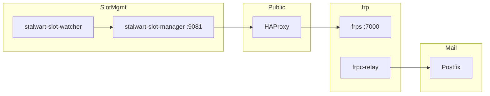

# VPS services

Public VPS at `193.180.211.139` (`mail.solace.onl`) for Stalwart on Railway.
Architecture diagrams: [README.md](README.md).

## Service map



## Services

All systemd units should be enabled (`systemctl enable`) for boot.

### HAProxy

- **Role:** Public TCP/HTTP edge; TLS on :443; PROXY v2 to frps mail backends.
- **Ports:** 25, 465, 993, 443
- **Repo:** `vps/haproxy.cfg` → `/etc/haproxy/haproxy.cfg`
- **Active slot:** `/etc/haproxy/stalwart-active-slot` (`blue` or `green`)

### frps

- **Role:** Accepts inbound frp tunnels from Railway.
- **Port:** 7000 (control); dynamic proxy ports whitelisted in `vps/frps.toml`
- **Repo:** `vps/frps.toml` → `/etc/frp/frps.toml`

### frpc-relay

- **Role:** STCP proxy exposing Postfix `127.0.0.1:2525` to Railway relay visitors.
- **Repo:** `vps/frpc-relay.toml` → `/etc/frp/frpc-relay.toml`
- **Required** for outbound mail from Railway (see [vps/OUTBOUND_RELAY.md](vps/OUTBOUND_RELAY.md))

### Postfix

- **Role:** Authenticated submission relay; delivers to the internet from the VPS IP.
- **Listen:** `127.0.0.1:2525` (STCP from Railway), `0.0.0.0:587` (optional direct access)
- **SASL user:** `relay-client@mail.solace.onl`
- **Repo:** `vps/postfix-main.cf`, `vps/postfix-master.cf`

### stalwart-slot-manager

- **Role:** HTTP API for active slot; triggers HAProxy runtime reconfiguration.
- **Port:** 127.0.0.1:9081 (public via HAProxy `/slot-manager/`)
- **Repo:** `vps/stalwart-slot-manager.py`

### stalwart-slot-watcher

- **Role:** Failover-only — promotes the other slot when the active tunnel dies.
- **Repo:** `vps/stalwart-slot-watcher.py` → `/usr/local/bin/stalwart-slot-watcher`

### gatus-monitor (optional)

- **Role:** JSON health snapshot for Gatus SSH probes from Railway (`status.solace.onl`).
- **Repo:** `vps/gatus-monitor.sh` → `/usr/local/bin/gatus-monitor.sh`
- **Setup:** See [gatus/README.md](gatus/README.md#optional)

## Operations

```bash
# Service status
systemctl status haproxy frps frpc-relay postfix stalwart-slot-manager stalwart-slot-watcher

# Active slot
cat /etc/haproxy/stalwart-active-slot

# Manual slot switch
sudo /usr/local/bin/stalwart-switch-slot.sh blue
sudo /usr/local/bin/stalwart-switch-slot.sh green

# Config validation
sudo haproxy -c -f /etc/haproxy/haproxy.cfg && sudo systemctl reload haproxy
sudo /usr/local/bin/haproxy-sync-active-slot.sh
sudo postfix check && sudo systemctl reload postfix
```

## Firewall (UFW)

Allow: 22, 25, 465, 587, 993, 443, 7000 (frp control from Railway).

Port 2525 is **not** exposed publicly — only reachable via the STCP tunnel.
