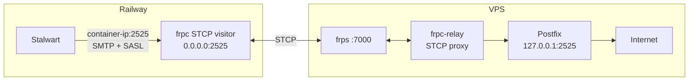

# Outbound mail relay

Railway blocks outbound SMTP (ports 25, 587, 465). Outbound mail from Solace
uses an frp **STCP tunnel** to Postfix on the VPS.

## Flow



**Do not** point the Stalwart relay route at the VPS public IP or
`mailsend.solace.onl:587` from Railway — those connections time out.

## Stalwart relay route (`relay-vps`)

| Field | Value |
|-------|-------|
| Address | Container private IP (auto-set by `railway-entrypoint.sh`) |
| Port | `2525` |
| Protocol | SMTP, STARTTLS |
| Username | `relay-client@mail.solace.onl` |
| Password | Must match Postfix `sasldb` |

Stalwart **rejects `127.0.0.1`** as a relay target. The entrypoint detects the
container IP (e.g. `10.250.x.x`) and updates route id `ivnbzc1aaba9` at startup.

Override with `RELAY_BIND_ADDR` if needed.

## VPS setup

```bash
# Enable the STCP proxy (required)
sudo systemctl enable --now frpc-relay

# Verify Postfix listens locally
ss -tlnp | grep 2525
```

Config files: `vps/frpc-relay.toml`, `vps/postfix-main.cf`, `vps/postfix-master.cf`.

## Sync relay password

If auth fails (`lost connection after AUTH` in `/var/log/mail.log`):

```bash
# On VPS — set Postfix SASL password
printf '%s' 'YOUR_NEW_PASSWORD' | sudo saslpasswd2 -p -c -u mail.solace.onl relay-client

# Update Stalwart relay route secret
stalwart-cli --url https://mail.solace.onl --api-key "$STALWART_ADMIN_TOKEN" \
  update MtaRoute ivnbzc1aaba9 \
  --json '{"authSecret":{"@type":"Value","secret":"YOUR_NEW_PASSWORD"}}'
```

## Troubleshooting

| Symptom | Likely cause |
|---------|----------------|
| Connection timeout to VPS :587 | Railway blocks outbound SMTP; use STCP path |
| `host resolves loopback address` | Relay route set to `127.0.0.1`; use container IP |
| `lost connection after AUTH` | SASL password mismatch between Stalwart and Postfix |
| No `submission-2525` in mail.log | STCP visitor not running or frpc-relay down |
| Relay route wrong after redeploy | `STALWART_ADMIN_TOKEN` missing; container IP changed |

```bash
# On VPS — recent relay activity
sudo grep submission-2525 /var/log/mail.log | tail -20

# On Railway container — STCP visitor listening
ss -tlnp | grep 2525
```

## Optional: `mailsend.solace.onl`

A DNS A record for `mailsend.solace.onl` → VPS IP is optional. Postfix also
listens on `0.0.0.0:587` for direct submission from outside Railway (e.g. manual
tests from the VPS). This is **not** the path used by Railway containers.
